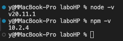
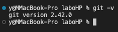
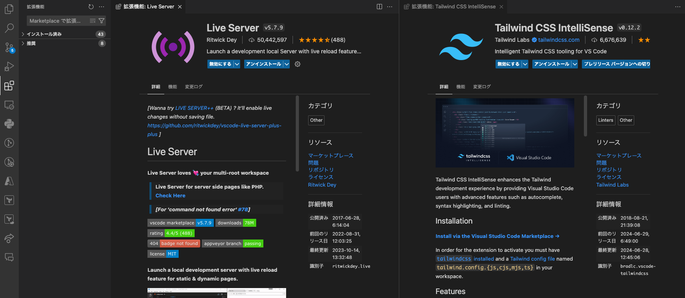
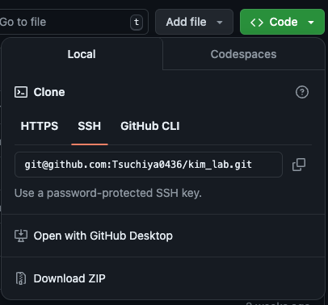
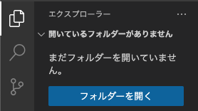
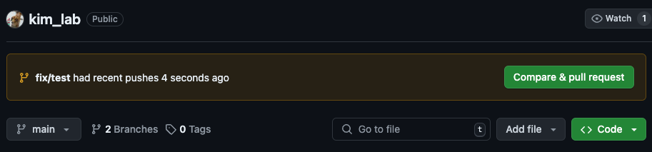
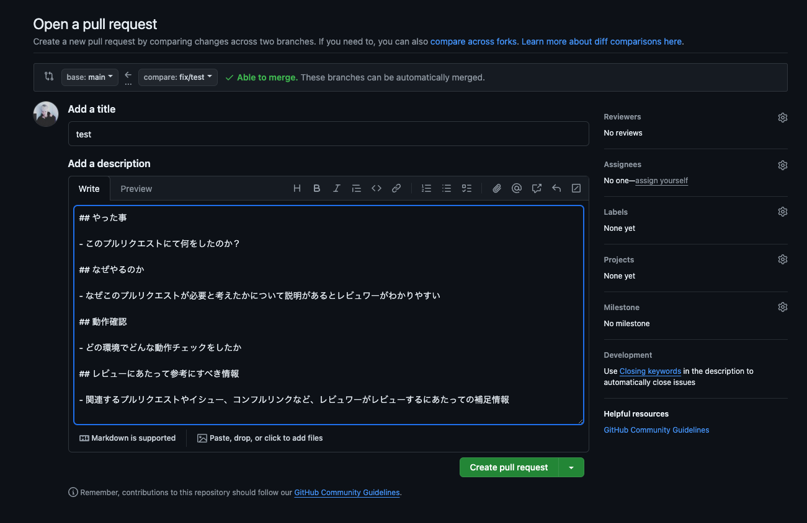

# 開発環境構築
本ページではHPを作成する上で必要な開発環境の構築を行なっていただきます。</br>
## STEP1 : Visual Studio Codeのインストール
- 既にVSCodeがインストールされている場合は、この操作は不要です。

- VSCodeが宗教上の理由で使えない方は、この操作は不要です。

	1. [Visual Studio Code 公式サイトを開きます。](https://code.visualstudio.com/)

	2. ご利用のPCにOSに合わせて、VSCodeをダウンロードします。

	3. ダウンロードしたファイルを実行し、指示に従ってVSCodeをインストールします。

## STEP2 : Node.jsのインストール
- 既にNode.jsがインストールされている場合はこの手順は不要です。

- 既にNode.jsのバージョン管理ツール（nvm, nodebrewなど）を使用している場合は、ツールを利用してインストールしていただいても構いません。

	1. [Node.js公式サイトを開きます](https://nodejs.org/en/download/prebuilt-installer)

	2. 「Download」→「Prebuilt Installer」を選択し、自身のOSに合わせてDownloadボタンを選択します。

	3. ダウンロードしたインストーラーを実行し、指示に従ってインストールします。

	4. インストール後、ターミナル（Windowsの場合、コマンドプロンプトや、PowerShell）を開き、以下のコマンドを実行してNode.jsが正常にインストールされたかどうかを確認します。
		```shell
		node -v
		```
		```shell
		npm -v
		```
	5. 正しくインストールされている場合、Node.jsとnpmのそれぞれのバージョンが表示されます</br>
		

## STEP3 : GitHubのアカウント登録
- 既にGitHubのアカウントをお持ちの方はこの手順は不要です。
	1. [GitHub公式サイトを開きます](https://github.co.jp/)

	2. サインアップを選択し、指示に沿ってアカウントを作成します。

## STEP4 : Gitのインストール
- 既にGitがインストールされているか場合、この手順は不要です。
	1. Gitをご自身のPCにインストールします。
		- Macを使っている場合：brewをインストールし、`brew install git`を実行します。
		- Windowsを使っている場合：[インストーラーをダウンロード](https://gitforwindows.org/)し、指示に従い、インストールしてください。

		※参考：[HomeBrewのインストール](https://qiita.com/zaburo/items/29fe23c1ceb6056109fd)
	2. インストール後、ターミナル（Windowsの場合、コマンドプロンプトや、PowerShell）を開き、以下のコマンドを実行してGitが正常にインストールされたかどうかを確認します。
		```shell
		git -v
		```
	3. 正しくインストールされている場合、Gitのバージョンが表示されます。
		
	
	4. インストールしたGitにユーザー名とメールアドレスを設定します。
		- 指定はないですが、先ほどGitHubに登録したメールアドレスとユーザー名をそのまま登録することをお勧めします。
		- ターミナル（Windowsの場合、コマンドプロンプトや、PowerShell）を開き、以下のコマンドを実行して設定します。
		```shell
		git config --global user.name "ユーザー名を入力"
		```
		```shell
		git config --global user.email "メールアドレスを入力"
		```
		- ユーザー名やメールアドレスなどを入力せずに実行すると現在登録されている設定を見ることができます。正しく設定されているか確認してみましょう。

## STEP5 : GitHubにSSHキーを設定する
- 既にGitHubにご自身の公開鍵が登録されている場合、この手順は不要です。

- 既にSSHキーがご自身のPCに存在する場合、3から開始してください。

	1. SSHキーを作成します。ターミナル（Windowsの場合、コマンドプロンプトや、PowerShell）を開き、以下のコマンドを実行してSSHキーを作成します。
		```shell
		ssh-keygen
		```
	2. SSHキーの保存先、パスワードを指定します。デフォルトで問題ない場合は何か聞かれるたびにEnterを押してください
		```shell
		Generating public/private rsa key pair.
		Enter file in which to save the key (/c/Users/<user_name>/.ssh/id_rsa):
		Enter passphrase (empty for no passphrase):
		Enter same passphrase again:
		```
	3. 作成したSSHキーの場所に移動します。以下のコマンドを実行してディレクトリを移動します。
		```shell
		cd ~/.ssh
		```
		デフォルトの保存先以外に保存した場合はパスを変更して移動してください。

		🔰 : **Point**</br>
		- cdコマンドとはディレクトリを移動するコマンドです。`cd <移動先>`

	4. 公開鍵の内容をコピーする。以下のコマンドを実行してid_rsa.pubファイルの中身を閲覧し、文字列をコピーします。
		```shell
		cat id_rsa.pub
		```
		🔰 : **Point**</br>
		- catコマンドとはファイルの中身を閲覧するコマンドです。`cat <ファイル名>`
		- id_rsaが秘密鍵、id_rsa.pubが公開鍵です。秘密鍵は絶対に公開しないようにしましょう

	5. コピーした公開鍵をGitHubに登録します。
		1. [GitHub](https://github.co.jp/)にサインインします。
		2. 右上のアイコンをクリックし、`Setting`を選択します。
		3. `SSH and GPG keys`から`New SSH Key`を選択します。
		4. `Title`に自分のわかりやすい名前をつけ、`Key`に先ほどコピーした公開鍵をペーストし、`Add SSH key`をクリックします。
		
		これらの手順を踏むことでSSHキーの登録が完了し、PCのターミナル（Windowsの場合、コマンドプロンプトや、PowerShell）からGitHubにアクセスすることができます。

## STEP6 : VSCode拡張機能のインストール
- 既に下記２つの拡張機能がインストールされている場合、この手順は不要です。

	🚨 : **Point**</br>
	このSTEPは必須ではありません、下記２つの拡張機能を入れる必要性を感じない方はスキップしていただいて大丈夫です。

	1. STEP1でインストールしたVSCodeを起動します。

	2. サイドバーの「拡張機能」アイコンをクリックして、検索欄から下記２つの拡張機能を検索し、インストールします。

		

		🔰 : **Point**</br>
		VScodeを日本語化したい場合、拡張機能で日本語verがあるため、そちらをインストールしてください。「日本語」とかで検索すると出てきます。

## STEP7 : GitHubに公開されているコードを手元にクローンする
- GitHubに公開されているコードを手元に持ってきて編集できるように設定します。

	🚨 : **Check**</br>
	- この先コードを編集してアップロードするためには権限が必要です。
	- まだ権限を付与してもらっていない場合、この場で付与してもらいましょう。

	1. [GitHubのリポジトリ](https://github.com/Tsuchiya0436/kim_lab)へ移動します。

	2. 緑色の`< > Code`ボタンをクリックして`SSH`を選択しSSH URLをコピーします。

		

	3. ターミナル（Windowsの場合、コマンドプロンプトや、PowerShell）を開き、`cd`コマンドなどでファイルのコピー先に移動し、以下のコマンドを実行します。
		```shell
		git clone <SSH URL> <任意のフォルダ名>
		```
		🔰 : **Point**</br>
		- `clone`するときにフォルダ名を指定することができます。
		- 何も指定しなかった場合、GitHub上で表示されているディレクトリ名になります。

	4. VSCode上でクローンしたファイルを開きます。
		- サイドバーのエクスプローラーから「フォルダを開く」を選択し、STEP7でcloneしたディレクトリを開いてください。

			

	5. 依存関係のinstall
		- 下記コマンドをVSCode上のターミナルで実行し、初期設定を終えてください。
			```shell
			npm install
			```

	6. HTMLファイルの変更を監視する
		- 当プロジェクトにはCSSを記述しやすくするフレームワーク「TailwindCSS」が入っています。

  		- TailwindCSSはCSSを記述しなくて良い代わりに、HTMLからCSSファイルを生成します。そのため、HTMLファイルに変更があった場合はCSSファイルを生成し直さなければなりません。 

		- しかし毎度毎度変更のたびにCSSファイルを手動で生成するのは大変なので、HTMLファイルの変更を監視し、変更があった場合はCSSファイルを更新してくれるウオッチモードを動作させます

		- 下記コマンドを実行してウオッチモードを動作させてください
			```shell
			npx tailwindcss -i ./src/css/main.css -o ./src/dist/main.css --watch
			```

## STEP8 : コードを編集してGitHubにPUSHする
- ここまできたら環境構築は終了です🎉🎉🎉

- あとは実際にコードを変更していきましょう。

- このSTEPでは実際にコードを変更してGitHubに自身が書いたコードを反映させるところまでを行います。

	1. コードをPULLする。
		- あなたがクローンした後に誰かがリモートにあるコードを変更したかもしれません。

		- その場合、あなたが変更してコードを送信すると、変更点が2箇所存在し、コードの衝突が発生します

		- そのため、下記のコマンドを実行し、ローカルのコードはこまめにPULLする癖をつけておきましょう

			```shell
			git pull origin main
			```

		🔰 : **Point**</br>
		- クラウド上のリポジトリをリモートリポジトリ、手元のPCのリポジトリをローカルリポジトリと言います。
		- コードの衝突のことをコンフリクトと言います。

	2. ブランチをきる
		- Gitにはブランチという機能が備わっています。簡単にいうとコードの変更履歴を枝分かれさせて管理するものです。

		- 詳しくは[こちら](https://backlog.com/ja/git-tutorial/stepup/01/)の解説を読んでください

		- コードの変更は基本的に新たなブランチを作成し、その中でコードを変更し、mainブランチへ変更のリクエストを送るといった形になります。

		- 下記コマンドで現在のブランチを確認することができます

		```shell
		git branch
		```
		- 下記コマンドで新規ブランチを作成することができます
		```shell
		git switch -c <branch_name>
		```

		🔰 : **Point**</br>
		- mainブランチとはリポジトリの主要なブランチのことで、基本的にmainブランチのコードがデプロイされ、HPとして外部に公開されます。

	3. コードを編集する。
		- 新規でブランチを作成したら作成したブランチ内でコードを変更してみましょう

		- HTMLファイルを選択した状態でVSCodeの右下、GoLiveの文字をクリックすると現在のコードのHPがどうなっているか見ることができます。

		- どこを変更すればどこが変わるのかを意識すると良いかもしれません

		🔰 : **Point**</br>
		- ここでの変更はまだ実際のHPやGitHub上のファイルに反映されていません。
		- もし破壊してしまった場合は迷わずわかる人に聞きましょう。一瞬で元通りになると思います。

	5. 変更したコードをGitHubリポジトリへ送信する
		- 変更したコードは３つの手順を用いてリモートリポジトリへ反映します。
			
			1. ワークツリーから変更ファイルを選択し、インデックスへ登録する
			2. インデックスに登録されたものをローカルリポジトリに反映する
			3. ローカルリポジトリの内容をリモートリポジトリに送信する

		- インデックスへの登録
			```shell
			git add <file_name or file_path>
			```
		- インデックスをローカルリポジトリへ反映する
			```shell
			git commit -m <comment>
			# ここでのcommentとはどんな変更を加えたかを伝えるコメントとなります
			# 一眼見ただけで何をしたかわかるコメントが推奨されます
			```
		- ローカルリポジトリの内容をリモートへ送信
			```shell
			git push origin <branch_name>
			```
		
		- ここまで来るとGitHub上であなたが変更したコードがあなたが作成したブランチにおいて反映されていると思います。

		- 次がようやく最後のパートです。あなたが変更したコードをmainブランチへ反映させるリクエストを送信してみましょう

		🔰 : **Point**</br>
		- Git参考資料：[サル先生のGit入門](https://backlog.com/ja/git-tutorial/)
		- `add`や`commit`、`push`などについての[参考記事](https://qiita.com/atsushi101011/items/96054ebbd876e378cac4)

## STEP9 :　プルリクエストを送信してコードをmainブランチに反映する
- あなたのコードは現在あなたが作成したブランチのみに反映されています。

- mainへ反映させるためにはプルリクエストなるものを作成し、他者にコードをレビューしてもらわなければなりません

	1. GitHubからPullRequestを作成します
	
		- `Compare & pull request`を選択
	
		
	
		- テンプレートに沿って記入
	
		
	
	2. 作成したプルリクエストを誰かにレビューしてもらいましょう！！

## 最後に
- このドキュメントは随時編集していただいて大丈夫です。

- 自身がわかりづらかった点や詰まったところを追記し、後続の人に優しいドキュメントにしていきましょう！！
